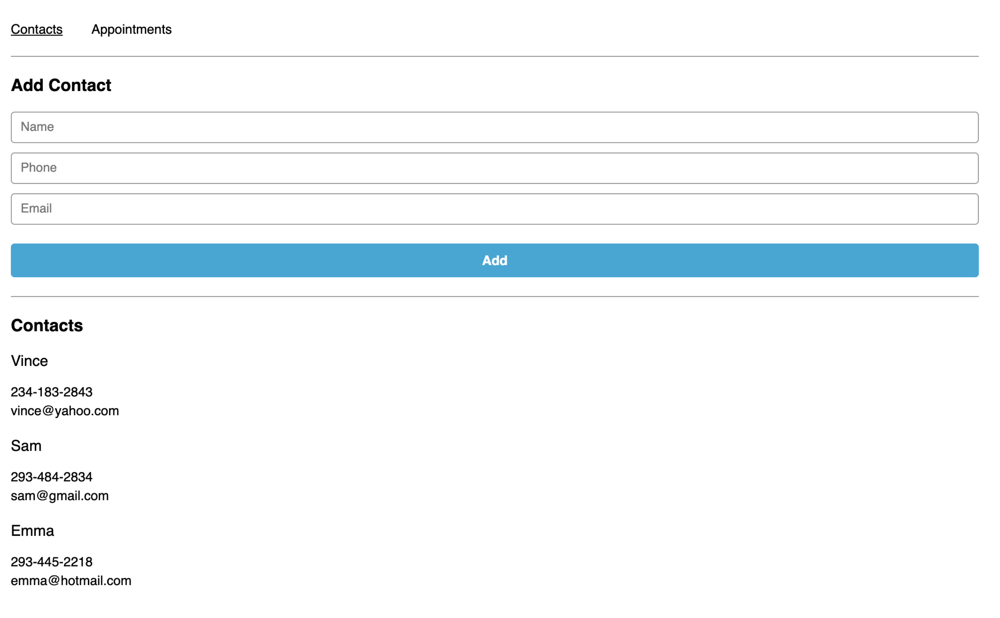
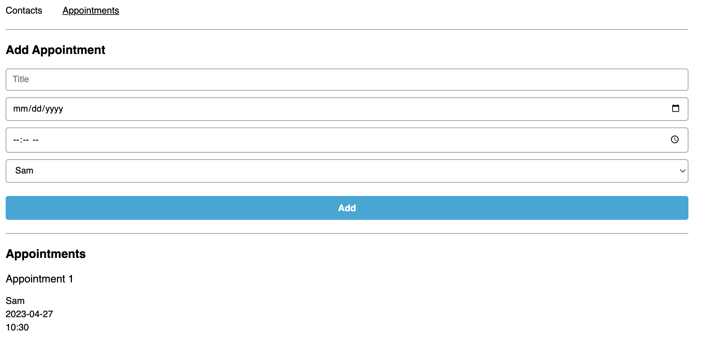

# React Challenge: Appointment Planner :rocket:

This repository stores my solution to the Codecademy challenge, "React Challenge: Appointment Planner". This challenge allowed me to apply the following concepts that I learned in the React framework:

* JSX
* React Components
* Components Interacting (e.g. passing props)
* Stateless Components From Stateful Components (e.g. containers vs. components, logic vs. displays)
* Hooks (e.g. useState, useEffect, etc.)

The actual functionality of the React web app is to be able to add contacts and appointments to a planner and displays the current contacts and appointments on their respective pages.

